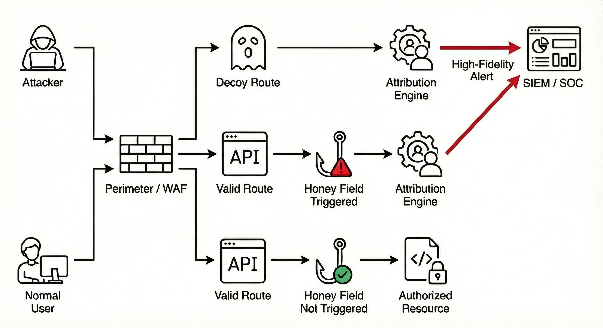

## **trappsec** 

trappsec is an open-source framework that helps developers detect attackers who probe API business logic. By embedding realistic decoy routes and honey fields that are difficult to distinguish from real API constructs, attackers are nudged to authenticate — converting reconnaissance into actionable security telemetry.

> Built for the 1% of people who actually look at their security alerts, **and** the 99% who just like the idea of having them — based on the radical idea that if you can’t further reduce your attack surface, expand it.

[Read the Docs](https://trappsec.dev/overview/) • [Ultra Quickstart](https://trappsec.dev/ultra-quickstart/)

 

---

### Core Concepts

* **Decoy Routes:** These are "ghost" endpoints that sit outside your real logic but look authentic. By planting dummy references in your client-side code, you can bait attackers into hitting these traps, allowing you to monitor their behavior via custom static or dynamic responses that adapt to the authentication status.

* **Honey Fields:** Non-functional parameters embedded within legitimate API endpoints that act as invisible tripwires. You can bait attackers by including them as hidden form fields with static values or leveraging existing "read-only" attributes that appear in GET responses as honey fields that trigger alerts if an attacker attempts to modify them via POST or PUT requests.

* **Identity Attribution:** Framework hooks allow you to link a request to an authenticated user identity. You can also map traps to a specific **intent** (Privilege Escalation, Reconnaissance etc). Put together, you get high-fidelity alerts that security teams can respond to quickly and more effectively.

---

### Best Practices

*  **Require Authentication:** In an internet that is mostly harmless but increasingly full of people and scanners (mostly scanners) poking things they shouldn't, you don’t want to get buried with noise. Use unauthenticated template responses like (401, Unauthorized) to guide them to probe with authentication.

*  **Blend In:** A trap should look exactly like a normal part of your API. A good trap should look like a mundane, standard - perhaps even tedious part of your API. If it looks "too good to be true", attackers will ignore it. Design traps to catch people trying to understand or manipulate your business logic.

---

### Alerting

trappsec can integrate directly into your existing workflows. Events are written to your standard logging handlers by default, but can be configured to also integrate into **OpenTelemetry** for observability or **Webhooks** to trigger automated responses or notify security teams.

---

### Supported Frameworks

<table>
  <thead>
    <tr>
      <th>Language</th>
      <th>Framework</th>
    </tr>
  </thead>
  <tbody>
    <tr>
      <td rowspan="7"><b>Python</b></td>
      <td>Flask</td>
    </tr>
    <tr><td>FastAPI</td></tr>
    <tr><td>Starlette</td></tr>
    <tr><td>Litestar</td></tr>
    <tr><td>Django</td></tr>
    <tr><td>Sanic</td></tr>
    <tr><td>Tornado</td></tr>
    <tr>
      <td rowspan="5"><b>Node.js</b></td>
      <td>Express</td>
    </tr>
    <tr><td>NestJS</td></tr>
    <tr><td>Fastify</td></tr>
    <tr><td>Hapi</td></tr>
    <tr><td>Koa</td></tr>
    <tr>
      <td rowspan="3"><b>Go</b></td>
      <td>net/http</td>
    </tr>
    <tr><td>Gin</td></tr>
    <tr><td>Echo</td></tr>
  </tbody>
</table>

> Missing your favorite framework? [Raise a request here](https://github.com/trappsec-dev/trappsec/discussions/new?category=feature-requests).

---

### Support
Community support is available via GitHub issues and discussions.  
For commercial support or services, email **nikhil@ftfy.co**.

