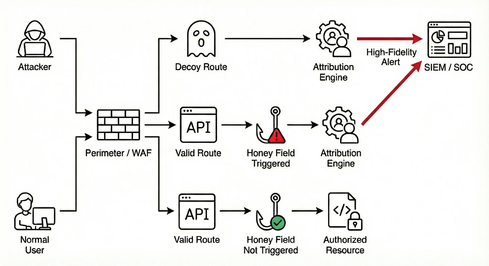

## **Your code is now a security sensor** 

**trappsec** is an open-source library that helps developers catch attackers probing their APIs. By adding decoy APIs and parameters into your codebase, we can turn attacker reconnaissance into actionable security telemetry.

> Built for the 1% of people who actually look at their security alerts, **and** the 99% who just like the idea of having them — based on the radical idea that if you can’t reduce your attack surface, expand it.

  <a href="./guide/" class="btn btn-primary fs-5 mb-2 mr-2">Get Started</a>
  <a href="https://github.com/trappsec-dev/trappsec" class="btn btn-outline-primary fs-5 mb-2 mobile-only">View on GitHub</a>

